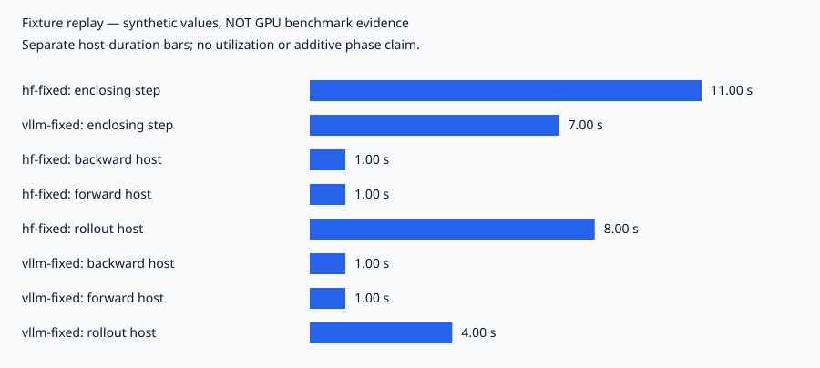

# RL Velocity

A one-card research harness for **simplified group-relative policy-gradient / REINFORCE**
updates with interchangeable Hugging Face and vLLM rollouts, in-process weight sync,
phase timing, and token-level sampling diagnostics. It does not implement full PPO/GRPO
clipping or a reference-policy KL term. **No learning improvement or GPU speedup is
established by the evidence in this repository.**

The contribution is inspectable instrumentation and correctness work, alongside documented
failed hypotheses. Start with the [sampling investigation](docs/sampling-config-inheritance.md),
[allocation negative result](docs/adaptive-allocation-negative.md), and
[measurement/reproduction limits](docs/reproduction.md).

## Offline demonstration — no GPU, downloads or dependencies

From a fresh clone, Python 3.9+ is enough:

```bash
python3 scripts/analyse.py --runs-dir evidence hf-fixed vllm-fixed
python3 scripts/compare_backends.py --backend report --out-dir evidence/comparison
```

These replay **hand-authored synthetic fixtures**, not original runs. The first command
reproduces [this transcript](evidence/replay.txt); the second shows identical aggregate
rewards with completely different outputs and explicitly declines to establish equivalence.
See the [manifest, inputs, commands and exclusions](evidence/MANIFEST.md) and
[comparison output](evidence/comparison/report.json).



Regenerate the figure with the standard library:

```bash
python3 scripts/analyse.py --runs-dir evidence hf-fixed vllm-fixed --svg evidence/phase-times.svg
```

Original benchmark, sampling and positive-control logs were not recovered. Earlier precise
speedups, throughput figures, reward tables and importance-ratio statistics have been
withdrawn from the public case study. Synthetic examples cannot substantiate them.

## What is implemented

| Component | Status and limits |
|---|---|
| Shared HF/vLLM rollout representation | Ragged masks, EOS retention and prompt padding covered by CPU tests; live backend parity unvalidated |
| Training update | Temperature-scaled scoring, per-sequence token-mean loss with a global sequence denominator; tested microbatch gradient invariance |
| Weight sync | In-process vLLM handoff present; version/hardware integration still needs a GPU run |
| Instrumentation | Synchronized enclosing step plus host phase/current-stream CUDA-event spans; no SM utilization claim |
| Sampling diagnostics | Explicit configuration and separate text/token/reward checks; no equivalence gate |
| Learning positive control | Historical notes describe an unsuccessful control; no original evaluation records available |
| Adaptive allocation | Completed historical proxy simulation investigation; not a training feature or demonstrated compute saving |
| Offline replay / CPU CI | Tracked synthetic inputs and portable regression suite; CI definition covers Linux, Windows, macOS |

Zero-advantage groups are a **token accounting** signal. Their tokens do not translate
linearly into recoverable wall-clock time. A CUDA event measures a stream interval, not
GPU utilization; host-minus-event time does not diagnose starvation.

## CPU development

Python 3.12+, no model downloads. Use a repository-local environment and cache:

```bash
UV_CACHE_DIR="$PWD/.cache/uv" uv venv --python 3.12 .venv
UV_CACHE_DIR="$PWD/.cache/uv" uv pip install --python .venv/bin/python -c requirements/cpu-tested.txt -e '.[cpu,dev]'
.venv/bin/python -m pytest -q
.venv/bin/python -m ruff check src tests scripts
```

On Windows use `.venv\Scripts\python.exe`; the [CI workflow](.github/workflows/cpu.yml)
uses an explicit CPU PyTorch wheel on Linux/Windows. [Exact locally tested CPU versions](requirements/cpu-tested.txt)
are separate from the [GPU candidate recipe](docs/reproduction.md). The base package has
no mandatory ML dependencies, and standard-library replay needs no package installation.

## GPU execution and reuse

Follow the [complete bounded GPU recipe](docs/reproduction.md#gpu-candidate-recipe)
only with suitable hardware. It is a **dependency-resolved, unvalidated candidate**,
not a reconstructed known-working environment. CUDA checks are not part of CPU CI.
No model or GPU workload was run for this readiness pass.

Licence selection is pending the owner. No licence has been added or changed; do not
assume an open-source licence grant from the repository's public visibility.
